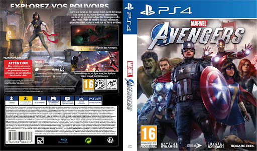

# 🕹️ Jour 1 – Lancement de l’atelier : Pose les bases de ton jeu !
## 🎬 Première étape : Comment on crée un jeu vidéo ?
Avant de commencer à inventer vos propres jeux, il est important de comprendre les grandes étapes de création d’un jeu vidéo. On ne se lance pas tête baissée dans la programmation !

👉 Regardez bien cette diapositive ensemble :
[Part création de jeu](https://docs.google.com/presentation/d/1QYttBEUXxV8z1SkGnxEV128GFIyC5pQs8lUqcrbQ_Z0/edit?usp=sharing)

Vous allez découvrir les différentes étapes indispensables :

- L’idée : Quel est le but du jeu ? Qu’est-ce qu’il raconte ? À quoi on joue ?
- Le game design : Quelles sont les règles ? Quelles actions le joueur peut faire ?
- Le level design : Comment sont organisés les niveaux ? Les obstacles ?
- Le graphisme : À quoi ressemble le jeu ? (personnages, décors…)
- Le son : Bruitages, musiques, voix…
- La programmation : Comment tout cela fonctionne ?
- Les tests et le polissage : Est-ce que tout marche ? Est-ce que c’est amusant ?

Ces étapes, vous allez toutes les vivre cette semaine, comme dans un vrai studio de jeu vidéo !

## 💡 Deuxième étape : Le Brainstorming
C’est le moment d’inventer votre jeu ! Mais attention :
🔸 Pas besoin d’un gros jeu, ce n’est pas un projet de plusieurs mois.
🔸 On vise un petit jeu simple, mais fun et surtout terminable en 5 jours.

📽️ Regardons maintenant la diapo sur le brainstorming :
[Atelier Idéation](https://docs.google.com/presentation/d/1ckUPDCtiEqG1isUnZLHKi6-qWBxeeDbdmxZebRYT8C0/edit?usp=sharing)

Voici ce que vous devez définir en groupe :

- Quel est le type de jeu ? (plateforme, puzzle, aventure, shoot…)
- Quel est le but du joueur ?
- Quel est le thème ? (espace, animaux, cuisine, pirates…)
- Quel est le style graphique ? (dessin animé, pixel art…)
- Quels sont les rôles dans le groupe ? (qui fait quoi ?)

Prenez des notes, discutez ensemble, écoutez les idées de chacun. À la fin du brainstorming, chaque groupe devra :
✔️ Avoir une idée claire et simple de son jeu
✔️ Répartir les rôles entre les membres du groupe
✔️ Éviter les idées trop compliquées ou impossibles à faire en 5 jours

## 🎨 Étape 3 : Créer la jaquette du jeu
Une fois que vous avez défini votre jeu, vous allez imaginer sa jaquette, comme s’il allait sortir en boîte ou être vendu sur une boutique en ligne.

Votre jaquette doit contenir :
- Le titre du jeu
- Une illustration principale (personnage, décor, action…)
- Le logo de votre studio (à inventer !)
- Des couleurs et un style qui donnent envie d’y jouer

🛠️ Outil conseillé : Canva
- Facile à utiliser, même pour les débutants
- Des modèles de jaquettes, d’affiches et de couvertures
- Possibilité d’ajouter des images, du texte, des effets…

## 🧠 Étape 4 : Comprendre les classifications PEGI
Avant de commencer à programmer vos jeux, vous devez aussi penser à pour qui vous créez votre jeu. Est-ce un jeu pour les enfants ? Pour les ados ? Peut-on y voir de la violence ou de la peur ?

👉 On regarde ensemble la diapo sur les PEGI
[PEGI](https://docs.google.com/presentation/d/1Gk98aRqTVBGvoG72nRFTbzsaAk6FrBno7NBpBULBJLI/edit?usp=sharing)

Expliquez :
- Ce que signifient les logos PEGI 3, 7, 12, 16, 18
- Les pictogrammes (violence, peur, langage grossier, etc.)
- Pourquoi c’est important de respecter l’âge conseillé selon le contenu du jeu

### 🎯 Mini-jeu / Quiz PEGI
Après l’explication, place à un petit jeu interactif pour bien retenir tout ça !
[Atelier Pegi](https://create.kahoot.it/share/atelier-pegi/04e7a851-f21d-4383-b710-853041826f14)
🎮 Kahoot spécial PEGI
- Chaque groupe ou élève participe au quiz
- Répondez aux questions sur la classification PEGI
- Le but est de mieux connaître les limites de contenu selon l’âge

# 🏁 Fin de journée : bilan et préparation du lendemain
- Chaque groupe valide que le contenu de son jeu correspond bien à un PEGI raisonnable
- Vous pouvez ajouter le logo PEGI choisi sur votre jaquette
- Brief rapide sur le programme du lendemain : début de la production (level design, graphismes, son, etc.)

