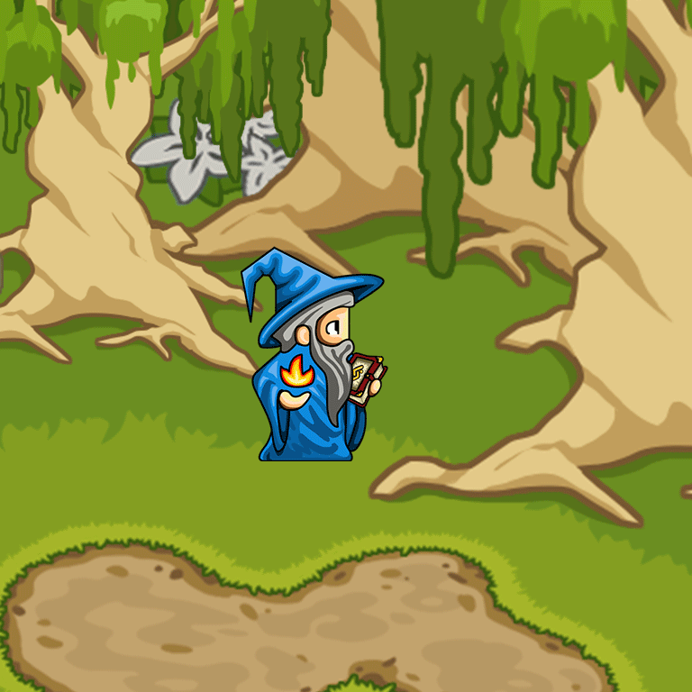
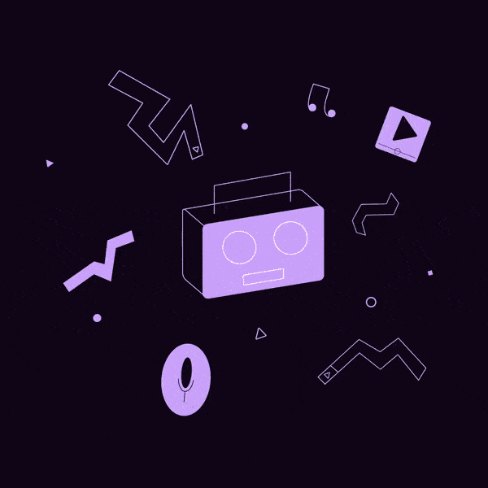

# 🎮 Journées 2, 3 et 4 – La production du jeu commence !
L’atelier entre maintenant dans sa phase la plus intense : la création réelle du jeu. Pendant ces trois jours, chaque groupe va avancer sur :
- La programmation avec GDevelop
- La création graphique des assets et de la map avec Piskel
- La recherche et intégration sonore
- Et surtout : la collaboration entre pôles

Chaque pôle part avec ses outils et objectifs clairs :

## 👨‍💻 Pôle Développement (Développeurs)

🛠️ Logiciel : GDevelop
Introduction à [l’interface de GDevelop](https://github.com/g404-code-gaming/GDevelop_Cour)

🎯 Objectifs de la journée :

- Créer une première scène jouable
- Gérer le déplacement, les interactions simples
- Prévoir l’espace pour les graphismes et sons à intégrer

## 🎨 Pôle Graphisme (Artistes)

🛠️ Logiciel : Piskel

- Découverte de Piskel (création de sprites en pixel art)
- Créer un personnage, un décor, des objets interactifs
- Organiser ses fichiers (sprites à nommer clairement)

🗺️ Création de la map :

- Utilisation de tuiles (tileset) pour construire le niveau
- Préparer les assets dans les bonnes dimensions pour GDevelop (ex. : 32x32, 64x64 pixels)

🎯 Objectifs de la journée :

- Produire les premiers assets visuels du jeu
- Créer une version simple de la map à tester dans GDevelop
- Exporter les fichiers dans un dossier commun

## 🔊 Pôle Son & Intégration (Audio)

🎧 Outils : sites de sons libres (Freesound, Pixabay Audio, etc.)

- Apprendre à rechercher des sons libres de droits (musique d’ambiance, bruitages)
- Comprendre les formats compatibles (WAV, MP3, etc.)
- Créer une ambiance sonore cohérente avec le thème du jeu

🎯 Objectifs de la journée :

- Sélectionner les sons pour le jeu (musique de fond, sons d’action, sons de menu)
- Préparer une bibliothèque de sons organisés pour le groupe

## 🔄 1h30 avant la fin – Rôle spécial : audio = mise en commun
Les élèves du pôle audio changent de rôle temporairement.
Ils deviennent les “intégrateurs” du groupe.

🧩 Leur mission :

- Récupérer les fichiers des artistes et des développeurs
- Placer les bons sons dans les bonnes scènes dans GDevelop
- Intégrer les assets graphiques dans le projet
- Aider à organiser le projet et vérifier que tout fonctionne ensemble

🛠️ Cela demande :

- D’ouvrir le projet GDevelop
- D’ajouter les assets au bon endroit
- De tester les sons (ex. : “quand le joueur saute, on entend un bruit”)

💬 Ils devront poser des questions, vérifier les noms de fichiers, demander de l’aide aux autres membres si besoin.
